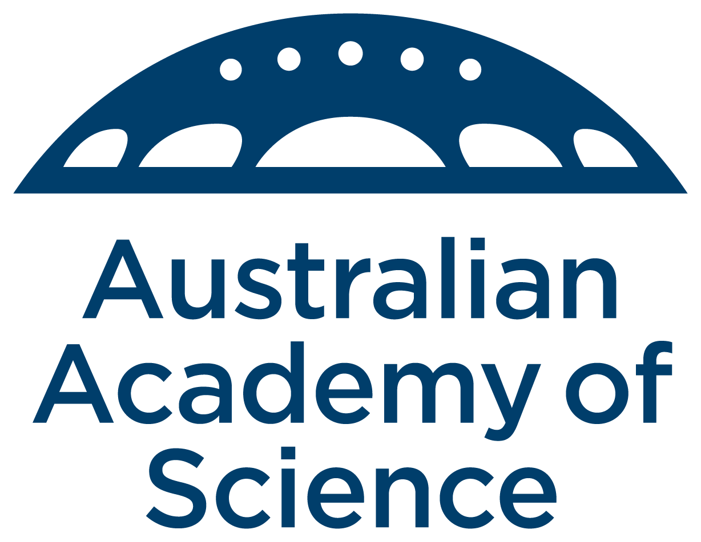

## News

**12/05/2022: Please register for the conference by Sunday 22nd May using the form on the link at the bottom of the page.**

**27/04/2022: The rescheduled conference will be held on Monday 4th and Tuesday 5th July 2022.** More information to follow.

**02/09/2021: The conference has been postponed due to ongoing Covid-19 related travel restrictions.** We aim to reschedule the conference around Easter 2022. More information will appear as the situation develops.

## About 

The conference is part of the [Australian Academy of Science Elizabeth and Frederick White Research Conference series](https://www.science.org.au/elizabeth-and-frederick-white-research-conferences).

## Background

The Southern Ocean controls the flux of heat to Australia’s south, governing the formation of key water masses which drive global ocean circulation, and is the gateway to Antarctica. It has rich dynamics spanning millimetre-scale turbulent mixing, metre-scale surface waves, kilometre-scale convection and eddies, and thousand-kilometre scale atmospheric weather systems.

The Southern Ocean is changing rapidly, and a key research question is whether it can continue soaking up anthropogenic heat and carbon dioxide, and providing other services that mitigate climate change. Numerical models founded on physical laws are the sole means for predicting future scenarios. Higher confidence in models, and hence better resilience for Australian and global communities, requires breakthroughs in understanding dynamics at all scales.

## Organisers

- [Cat Vreugdenhil](https://findanexpert.unimelb.edu.au/profile/865785-cat-vreugdenhil) (University of Melbourne)
- [Callum Shakespeare](https://earthsciences.anu.edu.au/people/academics/dr-callum-shakespeare) (Australian National University)
- [Luke Bennetts](https://luke-bennetts.com) (University of Adelaide)

## Program 

### Monday 4th July 2022

Planned start at 9:50am

**Turbulence**

- [Annie Foppert](https://rmdb.research.utas.edu.au/public/rmdb/q/indiv_detail_warp_trans/55816) (University of Tasmania)
- [Andy Hogg](https://earthsciences.anu.edu.au/people/academics/prof-andy-hogg) (Australian  National University)
- [Helen Phillips](https://www.utas.edu.au/profiles/staff/imas/helen-phillips) (University of Tasmania)
- [Madi Rosevear](https://research-repository.uwa.edu.au/en/persons/madi-gamble-rosevear) (University of Western Australia) 

**Cryosphere**

- [Petra Heil](https://www.antarctica.gov.au/science/meet-our-scientists/dr-petra-heil-sea-ice-scientist/) (Australian Antarctic Program)
- [Craig McConnochie](https://www.canterbury.ac.nz/engineering/contact-us/people/craig-mcconnochie.html) (University of Canterbury, New Zealand)
- [Fabien Montiel](https://www.maths.otago.ac.nz/?people=fabien_montiel) (University of Otago, New Zealand)
- [Noa Kraitzman](https://maths.anu.edu.au/people/academics/noa-kraitzman) (Australian National University)
- [Jordan Pitt](https://researchers.adelaide.edu.au/profile/jordan.pitt) (University of Adelaide)

### Tuesday 5th July 2022

**Circulation**

- [Adele Morrison](https://earthsciences.anu.edu.au/people/academics/dr-adele-morrison) (Australian National University)
- [Paul Spence](https://paulspence.github.io) (University of Tamania)
- [Kial Stewart](https://earthsciences.anu.edu.au/people/academics/dr-kial-stewart) (Australian National University)
- [Taimoor Sohail](https://sites.google.com/view/taimoorsohail/home) (University of New South Wales)
- [Xihan Zhang](http://ecite.utas.edu.au/rmdb/ecite/q/ecite_view_author/55966) (University of Tasmania)

**Internal waves**

- [Nicole Jones](https://research-repository.uwa.edu.au/en/persons/nicole-jones) (University of Western Australia)
- [Matt Rayson](https://research-repository.uwa.edu.au/en/persons/matt-rayson) (University of Western Australia)
- [Amelie Meyer](https://www.utas.edu.au/profiles/staff/imas/amelie-meyer) (University of Tasmania)

Planned close at 3:45pm

### Registration

Please register you interest to participate in the conference using the [registration form](https://docs.google.com/forms/d/e/1FAIpQLSfiYJOEtRwdrLFUx_BhqmJw8DjR2oOC8JRmjc1NtoTVmLcjzA/viewform?usp=sf_link)
by **Sunday 22nd May 2022**.

**Registration is free!**

**Speakers do not need to register.**

### Venue

[Finkel Lecture Theatre](https://studentvip.com.au/anu/main/maps/146896), Australian National University

### Accommodation

Coming soon

### Sponsors

We are grateful for support from the [Australian Academy of Science](https://www.science.org.au) and the [ARC Centre of Excellence for Climate Extremes](https://climateextremes.org.au).

### Flyer

Click [here](https://github.com/lgbennetts/AAS-MSDS0-2021/blob/main/AASSODynamics_Poster.png)

